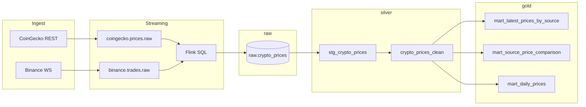

# Crypto Pulse

Data platform de criptomonedas con zonas **raw → silver → gold**.

[](https://github.com/kegare825/crypto-pulse/actions/workflows/ci.yml)

> **Portfolio project** — not financial advice. See [docs/ARCHITECTURE.md](docs/ARCHITECTURE.md) for design decisions and known limitations.

```
CoinGecko (REST) ──→ coingecko.prices.raw ──┐
                                            ├──→ Kafka → Flink SQL → raw.crypto_prices
Binance (WS)     ──→ binance.trades.raw  ──┘         ↓
                                                  dbt (silver → gold)
                                                       ↓
                                    Great Expectations (quality)
                                                       ↓
                         Metabase (BI)  |  Grafana + Prometheus (ops)
```

### Lineage (Raw → Silver → Gold)



## Documentación de datos

| Recurso | Descripción |
|---------|-------------|
| [dbt docs](#documentación-de-datos) | Lineage + diccionario de columnas (`dbt docs generate`) |
| [`dbt/models/*/schema.yml`](dbt/models/gold/schema.yml) | Descripciones y tests por modelo |
| [`contracts/crypto_price_event.schema.json`](contracts/crypto_price_event.schema.json) | Contrato JSON Kafka (validado en CI **y** runtime) |
| [`docs/ARCHITECTURE.md`](docs/ARCHITECTURE.md) | Decisiones de diseño |

Generar documentación dbt localmente:

```bash
bash scripts/generate_dbt_docs.sh
cd dbt && dbt docs serve --profiles-dir .
```

En CI, el artefacto **dbt-docs** se sube en cada run (GitHub Actions → workflow **CI** → job **dbt docs generate**).

## Observabilidad y BI

| Herramienta | URL | Rol |
|-------------|-----|-----|
| **Metabase** | http://localhost:3000 | Dashboards de negocio sobre schema `gold` |
| **Dagster** | http://localhost:3002 | Orquestación dbt + GX (jobs, schedules, lineage) |
| **Grafana** | http://localhost:3001 | Salud del pipeline (admin / ver `.env`) |
| **Prometheus** | http://localhost:9090 | Scraping de métricas técnicas |
| **Ingest metrics** | http://localhost:8000/metrics | Métricas producer CoinGecko |
| **Binance metrics** | http://localhost:8001/metrics | Métricas producer Binance WS |

### Metabase

Importa **3 dashboards** (Prices, Data Quality, Freshness & SLA):

```bash
# 1. Conecta PostgreSQL en Metabase (primera vez): host postgres, DB cryptopulse, schema gold
# 2. Importa todos los dashboards:
METABASE_EMAIL=tu@email.com \
METABASE_PASSWORD=tu_password \
python3 metabase/setup_dashboard.py
```

Abre las URLs que imprime el script.

| Dashboard | Contenido |
|-----------|-----------|
| **Crypto Pulse — Prices** | Spread multi-fuente, latest, daily |
| **Crypto Pulse — Data Quality** | Volúmenes por zona, null checks |
| **Crypto Pulse — Freshness & SLA** | Staleness por fuente, gap CoinGecko/Binance |

Detalle en [`metabase/README.md`](metabase/README.md).

#### Metabase (primera vez — conexión DB)

1. Abre http://localhost:3000 y crea tu cuenta admin.
2. **Add database** → PostgreSQL:
   - Host: `postgres` (desde tu máquina usa `localhost`)
   - Port: `5432`
   - Database: `cryptopulse`
   - User / Password: `pulse` / `pulse`
3. En la conexión, limita el schema visible a **`gold`**.
4. Ejecuta `python3 metabase/setup_dashboard.py` (ver arriba) o crea preguntas manualmente desde `metabase/questions/`.

Si Metabase no arranca (DB `metabase` inexistente en volúmenes antiguos):

```bash
docker exec crypto-pulse-postgres psql -U pulse -d postgres -c \
  "CREATE DATABASE metabase OWNER pulse;"
docker compose up -d metabase
```

### Grafana

- Login: `admin` / valor de `GRAFANA_ADMIN_PASSWORD` (default `admin`)
- Dashboard provisionado: **Crypto Pulse — Pipeline Health**
- Datasources: Prometheus + PostgreSQL (gold)

### Prometheus scrapea

- `ingest:8000` — CoinGecko: mensajes publicados, errores API, último poll
- `binance-ingest:8001` — Binance WS: trades publicados, throttle drops, reconexiones
- `kafka-exporter:9308` — lag, offsets
- `postgres-exporter:9187` — stats PostgreSQL
- `flink-jobmanager:9249` / `flink-taskmanager:9250` — métricas Flink

**Alertas** (reglas en `observability/prometheus/alerts.yml`, visibles en Prometheus → Alerts):

| Alerta | Condición |
|--------|-----------|
| `CoingeckoPollStale` | Sin poll exitoso en 5+ min |
| `CoingeckoApiErrors` | Errores API en 15 min |
| `BinancePublishStale` | Sin mensajes publicados en 10 min |
| `BinanceWsErrors` | Reconexiones WS repetidas |
| `FlinkNoRunningJobs` | Job streaming caído |
| `KafkaConsumerLagHigh` | Lag Flink > 5000 msgs |
| `PostgresDown` | Exporter no alcanza PG |

Ver alertas: http://localhost:9090/alerts

## CI

Cada push/PR ejecuta (`.github/workflows/ci.yml`):

| Job | Qué valida |
|-----|------------|
| **test** | pytest (normalización, contrato JSON, runtime validator) |
| **dbt** | `dbt parse` + `dbt compile` |
| **dbt-integration** | Postgres efímero → `dbt run` + `dbt test` |
| **quality** | Postgres seed → `dbt run` → Great Expectations |
| **dbt-docs** | `dbt docs generate` (artefacto descargable) |
| **infra** | `docker compose config` + `promtool check rules` |

Workflow **Smoke E2E** (`.github/workflows/smoke.yml`): nightly + manual — mismo camino que `scripts/smoke_test.sh`.

Branch protection recomendada: [`docs/CI.md`](docs/CI.md).

Local:

```bash
pip install -r requirements-dev.txt
pytest tests/ -v

# dbt integration (Postgres en localhost:5432)
bash ci/init_postgres.sh
cd dbt && dbt deps --profiles-dir . && dbt run --profiles-dir . && dbt test --profiles-dir .
```

### Publicar en GitHub (primera vez)

1. Crea el repo vacío en https://github.com/new → nombre `crypto-pulse` (sin README).
2. En tu máquina (el remote `origin` ya apunta a `kegare825/crypto-pulse`):

```bash
git push -u origin main
```

GitHub **no acepta contraseña** en `git push`. Usa un [Personal Access Token](https://github.com/settings/tokens) (scope `repo`) como contraseña, o configura [SSH](https://docs.github.com/en/authentication/connecting-to-github-with-ssh).

3. Tras el push, abre **Actions** y confirma que el workflow **CI** pasa en verde. El badge del README se activará solo.

## Contrato de eventos

Schema compartido: [`contracts/crypto_price_event.schema.json`](contracts/crypto_price_event.schema.json) — validado en CI contra eventos de CoinGecko y Binance.

## Próximos pasos

- **Fase C** — MinIO data lake + particionado (ver roadmap en [`docs/ARCHITECTURE.md`](docs/ARCHITECTURE.md))
- Terraform para cloud
- Alertmanager → Slack/email (opcional)
- _(Opcional)_ MinIO/S3 como data lake decoupled (Opción B)

## Arquitectura de zonas

| Zona | Ubicación | Responsable | Contenido |
|------|-----------|-------------|-----------|
| **raw** | Kafka + `raw.crypto_prices` | Flink | Eventos crudos de CoinGecko y Binance (`source`) |
| **silver** | `silver.*` | dbt | Limpieza, deduplicación, tipos consistentes |
| **gold** | `gold.*` | dbt | Marts analíticos para BI |

### Modelos gold

| Modelo | Descripción |
|--------|-------------|
| `mart_latest_prices` | Último precio por coin (solo CoinGecko, compat BI) |
| `mart_latest_prices_by_source` | Último precio por coin y fuente |
| `mart_source_price_comparison` | Spread CoinGecko vs Binance por coin |
| `mart_daily_prices` | Agregados diarios por coin y fuente |
| `mart_zone_volume` | Conteos por zona/fuente (dashboard Quality) |
| `mart_freshness_by_source` | Staleness y SLA por fuente (dashboard Freshness) |
| `mart_gold_sanity` | Null checks en marts gold |
| `fct_price_changes` | Cambio punto a punto entre ticks (por fuente) |

## Quick start

```bash
cp .env.example .env
docker compose up --build
```

Servicios:

| Servicio | Puerto | Rol |
|----------|--------|-----|
| `kafka` | 9092 | Bus de eventos (raw stream) |
| `postgres` | 5432 | Warehouse (raw/silver/gold) |
| `ingest` | 8000 | CoinGecko → `coingecko.prices.raw` |
| `binance-ingest` | 8001 | Binance WS → `binance.trades.raw` (throttle ~1 msg/s/símbolo) |
| `flink-*` | 8081 | Kafka → `raw.crypto_prices` |
| `transform` | — | Dagster schedule → dbt run/test + Great Expectations |
| `prometheus` | 9090 | Métricas técnicas |
| `grafana` | 3001 | Dashboards ops |
| `metabase` | 3000 | BI sobre schema `gold` |

## Verificar el pipeline

```bash
# Raw (Flink landing)
docker exec crypto-pulse-postgres psql -U pulse -d cryptopulse -c \
  "SELECT coin_id, price_usd, recorded_at FROM raw.crypto_prices ORDER BY recorded_at DESC LIMIT 5;"

# Silver (dbt cleaned)
docker exec crypto-pulse-postgres psql -U pulse -d cryptopulse -c \
  "SELECT coin_id, price_usd, recorded_at FROM silver.crypto_prices_clean ORDER BY recorded_at DESC LIMIT 5;"

# Gold (BI-ready)
docker exec crypto-pulse-postgres psql -U pulse -d cryptopulse -c \
  "SELECT * FROM gold.mart_latest_prices;"

# Comparación por fuente
docker exec crypto-pulse-postgres psql -U pulse -d cryptopulse -c \
  "SELECT * FROM gold.mart_source_price_comparison;"

# Logs de transformación + calidad
docker logs -f crypto-pulse-transform
```

## Orquestación (Dagster)

El servicio `transform` ejecuta un **schedule Dagster** (`transform_job`): `dbt run` → `dbt test` → Great Expectations.
- Intervalo: `TRANSFORM_INTERVAL_SECONDS` (default 300s)
- Ciclo manual (sin esperar al schedule):

```bash
docker compose run --rm transform /app/run-transform.sh
```

Código en [`orchestration/`](orchestration/).

## dbt (manual)

```bash
docker compose run --rm transform dbt run --profiles-dir /app/dbt
docker compose run --rm transform dbt test --profiles-dir /app/dbt
```

Proyecto en `dbt/`:

- `models/silver/` — staging + tabla limpia incremental
- `models/gold/` — marts para dashboards
- Tests: `not_null`, `unique`, `accepted_values`, `dbt_utils.unique_combination_of_columns`

## Great Expectations

Validaciones en `quality/validate.py` (ejecutadas por `transform`):

| Check | Zona |
|-------|------|
| Row count > 0 | raw, silver, gold |
| `coin_id`, `price_usd`, `recorded_at` not null | todas |
| `coin_id` in (bitcoin, ethereum, solana) | todas |
| `price_usd` > 0 | todas |
| Unicidad `(coin_id, source, recorded_at)` | raw, silver |
| `source` in (coingecko, binance) | raw, silver |
| Freshness < 10 min | raw |
| Volumen mínimo por `source` (`GE_MIN_ROWS_PER_SOURCE`) | raw |
| Cobertura 3 coins por `source` (`GE_MIN_COINS_PER_SOURCE`) | raw |
| 1 fila por coin en `mart_latest_prices` | gold |
| Filas en `mart_source_price_comparison` | gold |

Ejecutar solo calidad:

```bash
docker compose run --rm transform python /app/validate.py
```

## Migración desde versión anterior

Si ya tenías `public.crypto_prices`:

```bash
docker exec -i crypto-pulse-postgres psql -U pulse -d cryptopulse < postgres/migrate-to-zones.sql
docker compose up --build flink-submitter transform
```

Si ya tenías zonas raw/silver/gold **sin** columna `source`:

```bash
docker exec -i crypto-pulse-postgres psql -U pulse -d cryptopulse < postgres/migrate-add-source.sql
docker compose up --build flink-submitter
docker compose run --rm transform bash -c "dbt deps --profiles-dir /app/dbt && dbt run --full-refresh --profiles-dir /app/dbt"
```

## Paso 1: Kafka (ingesta)

CoinGecko:

```bash
docker compose logs -f ingest
```

Binance (WebSocket, throttle configurable):

```bash
docker compose logs -f binance-ingest
```

Leer stream CoinGecko:

```bash
docker compose run --rm --no-deps ingest python -u consumer.py
```

## Paso 2: Flink → raw

Flink escribe en `raw.crypto_prices`. UI: http://localhost:8081

Relanzar job Flink:

```bash
docker compose up --build flink-submitter
```

## Variables de entorno

| Variable | Default | Descripción |
|----------|---------|-------------|
| `COINGECKO_COIN_IDS` | `bitcoin,ethereum,solana` | Coins a trackear |
| `POLL_INTERVAL_SECONDS` | `60` | Intervalo ingesta CoinGecko |
| `BINANCE_KAFKA_TOPIC` | `binance.trades.raw` | Topic Kafka Binance |
| `BINANCE_STREAMS` | `btcusdt@trade,...` | Streams WS Binance |
| `BINANCE_THROTTLE_SECONDS` | `1` | Mín. segundos entre publicaciones por símbolo |
| `TRANSFORM_INTERVAL_SECONDS` | `300` | Intervalo dbt + GX |
| `GE_FRESHNESS_MINUTES` | `10` | Máx. antigüedad datos raw |
| `GE_MIN_ROWS_PER_SOURCE` | `1` | Mín. filas por fuente (24h) en GX |
| `GE_MIN_COINS_PER_SOURCE` | `3` | Coins requeridos por fuente en GX |
| `GRAFANA_ADMIN_PASSWORD` | `admin` | Password admin Grafana |
| `METABASE_URL` | `http://localhost:3000` | URL Metabase (import dashboard) |
| `METABASE_EMAIL` | — | Email admin Metabase (`setup_dashboard.py`) |
| `METABASE_PASSWORD` | — | Password admin Metabase |

## Paso 3: Observabilidad

Ver sección **Observabilidad y BI** arriba.
