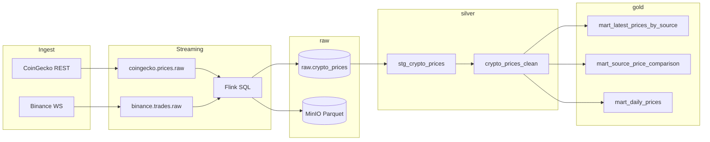
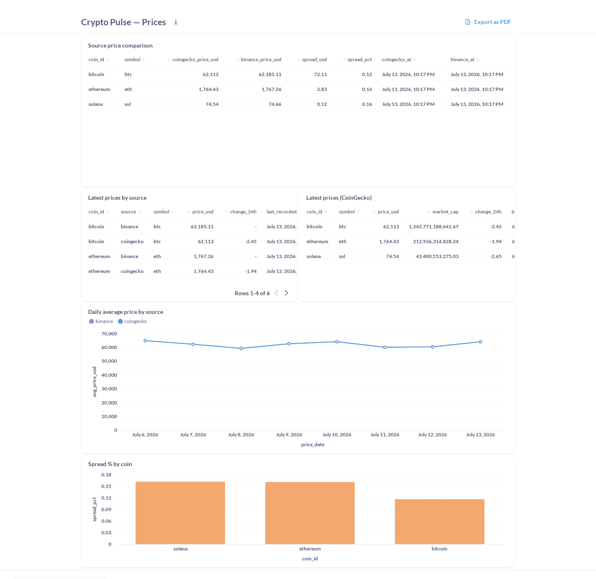
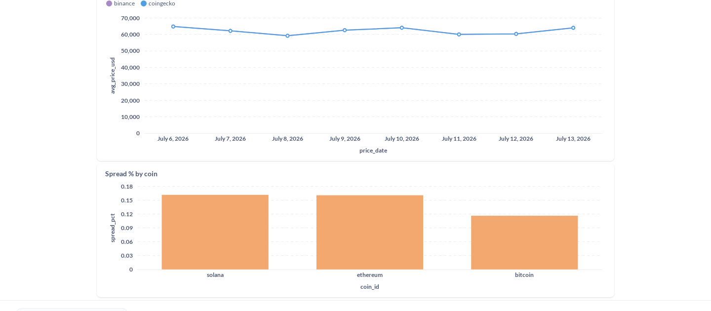
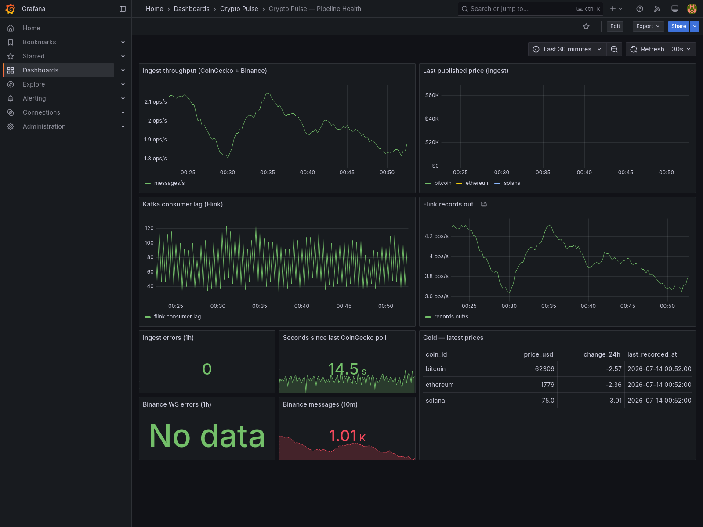
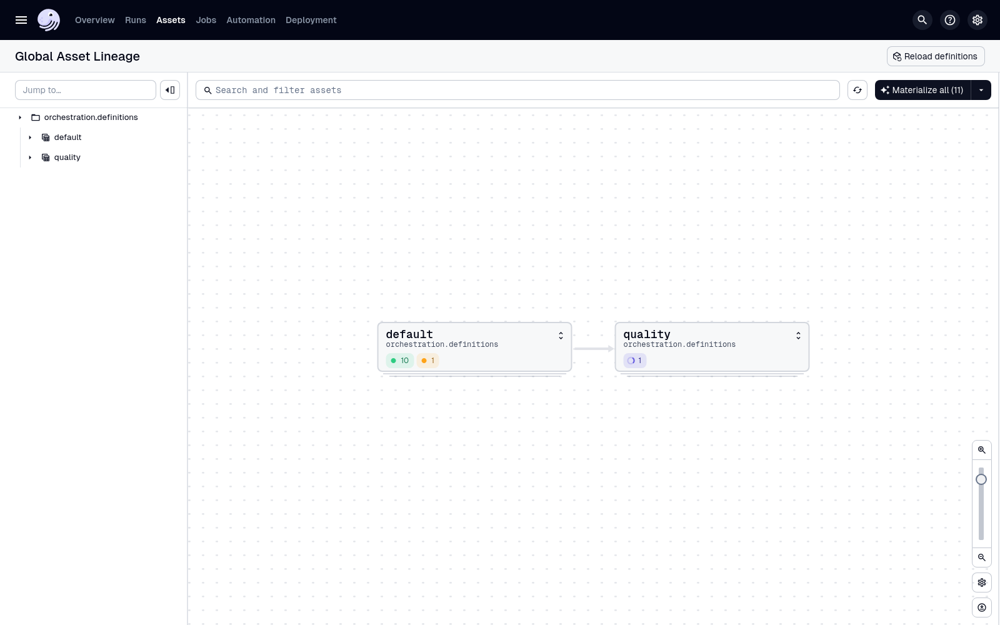
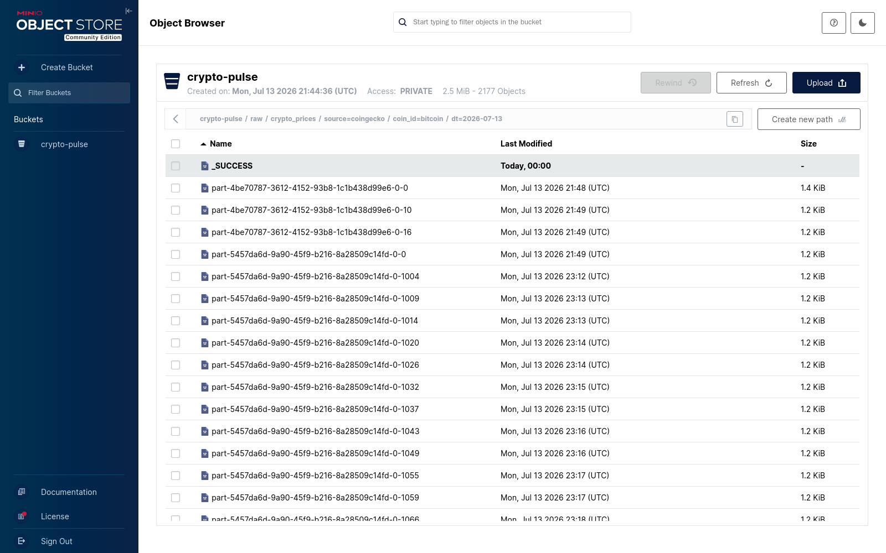

# Crypto Pulse

**Real-time crypto data platform** — CoinGecko + Binance → Kafka → Flink → lake + warehouse → dbt gold → BI & ops.

Medallion zones **raw → silver → gold**, contract-validated ingest, CI-tested transforms, and split storage (MinIO) vs serving (PostgreSQL).

[](https://github.com/kegare825/crypto-pulse/actions/workflows/ci.yml)

> **Portfolio project** — not financial advice. Design decisions: [docs/ARCHITECTURE.md](docs/ARCHITECTURE.md) · [ADRs](docs/adr/README.md) · [SLA](docs/SLA.md)

## Portfolio highlights

- **Stack:** Kafka, Flink SQL, dbt, Dagster, Great Expectations, MinIO, PostgreSQL, Metabase, Grafana, Prometheus
- **Pattern:** medallion (raw → silver → gold) with lakehouse-lite dual-write — Parquet lake for archive, Postgres for serving
- **Quality:** JSON Schema contract at ingest (CI **and** runtime), dbt tests, GX freshness SLAs (< 10 min), 8 gold marts, dead-letter queue for invalid payloads
- **Ops:** exactly-once Flink checkpoints + watchdog self-healing, Prometheus alerting, 7-job CI (incl. Testcontainers Kafka integration) + nightly smoke E2E
- **Docs:** [architecture](docs/ARCHITECTURE.md), [7 ADRs](docs/adr/README.md), [SLA policy](docs/SLA.md), [dbt docs on GitHub Pages](https://kegare825.github.io/crypto-pulse/)

## What this demonstrates

- **Streaming ingest** — multi-source Kafka, Flink SQL dual sink (Postgres + Parquet lake)
- **Lakehouse-lite** — MinIO S3-compatible storage decoupled from PostgreSQL serving layer
- **Data quality** — JSON Schema at the edge, dbt tests, Great Expectations, freshness SLAs
- **Platform ops** — Dagster Software-Defined Assets (dbt lineage graph), Prometheus/Grafana, CI + nightly smoke E2E

## Architecture (high level)

```
CoinGecko (REST) ──→ coingecko.prices.raw ──┐
                                            ├──→ Kafka → Flink SQL ──┬→ MinIO (Parquet raw)
Binance (WS)     ──→ binance.trades.raw  ──┘                        └→ Postgres raw
                                                                              ↓
                                                                        dbt (silver → gold)
                                                                              ↓
                                                          Great Expectations + Metabase / Grafana
```

Storage vs serving: [docs/DATA_LAKE.md](docs/DATA_LAKE.md)

### Lineage (raw → silver → gold)



## Screenshots

> Captured from a live run (see [demo capture session](#demo-capture-session) to reproduce).

| CoinGecko vs Binance spread (Metabase) | Spread % by coin (Metabase) |
|---|---|
|  |  |

| Pipeline health (Grafana) | `transform_job` run (Dagster) |
|---|---|
|  |  |

| Hive-style lake partitions (MinIO) |
|---|
|  |

## Verify in 5 minutes

After `docker compose up --build` (wait for ingest + Flink submitter + one Dagster cycle):

```bash
# Gold — BI-ready marts
docker exec crypto-pulse-postgres psql -U pulse -d cryptopulse -c \
  "SELECT * FROM gold.mart_source_price_comparison;"

# Raw — Flink landing in Postgres
docker exec crypto-pulse-postgres psql -U pulse -d cryptopulse -c \
  "SELECT coin_id, source, price_usd, recorded_at FROM raw.crypto_prices ORDER BY recorded_at DESC LIMIT 5;"

# Lake — Parquet objects on MinIO
bash scripts/verify_lake.sh
```

More checks: [Verify the pipeline](#verify-the-pipeline) below.

## Quick start

```bash
cp .env.example .env
docker compose up --build
```

| Service | Port | Role |
|---------|------|------|
| `kafka` | 9092 | Event bus |
| `postgres` | 5432 | Serving layer (raw / silver / gold) |
| `minio` | 9000 / 9001 | Storage layer (Parquet raw, S3 console) |
| `ingest` | 8000 | CoinGecko → `coingecko.prices.raw` |
| `binance-ingest` | 8001 | Binance WS → `binance.trades.raw` (~1 msg/s per symbol) |
| `dlq-monitor` | 8002 | Watches `crypto-pulse.dlq`, exposes dead-letter metrics |
| `flink-*` | 8081 | Kafka → Postgres + MinIO (dual sink) |
| `flink-watchdog` | — | Resubmits Flink job if none running |
| `transform` | 3002 | Dagster → dbt + Great Expectations |
| `metabase` | 3000 | BI on schema `gold` |
| `grafana` | 3001 | Pipeline health |
| `prometheus` | 9090 | Metrics |

## Demo capture session

Production-like defaults (`.env.example`: 60s polling, 300s transform) are intentionally conservative, so fresh stacks take a while to produce dense charts. For screenshots or a live demo, use the demo profile:

```bash
cp .env.demo .env                    # 15s CoinGecko polling, 60s Dagster refresh
docker compose up --build
bash scripts/seed_demo_history.sh    # 7 days of hourly history → daily trend charts
```

The seed backfills `raw.crypto_prices` (idempotent) and runs `dbt run --full-refresh` so the incremental silver model picks up the historical rows. `mart_daily_prices` then shows a full week of points instead of a single day.

Revert when done:

```bash
cp .env.example .env
docker compose up -d --force-recreate ingest transform
```

## Fault tolerance

Single-node portfolio setup — not multi-broker HA, but survives common restarts. See [ADR 006](docs/adr/006-resilience-kafka-flink.md).

| Layer | Mechanism |
|-------|-----------|
| **Kafka** | Persistent `kafka_data` volume, `restart: unless-stopped`, explicit topics (7d retention), idempotent producers (`acks=all`) |
| **Flink** | Checkpoints every 30s (EXACTLY_ONCE), fixed-delay restart, sink retries, offset restore from checkpoints |
| **Recovery** | `flink-watchdog` resubmits the SQL pipeline when JobManager has no active job |
| **Bad data** | Invalid/malformed payloads routed to `crypto-pulse.dlq` instead of silently dropped ([ADR 007](docs/adr/007-dead-letter-queue.md)) |

Quick test: `docker compose restart kafka flink-taskmanager` — ingest reconnects; Flink heals via checkpoints + watchdog.

## Documentation

| Resource | Description |
|----------|-------------|
| [dbt docs (live)](https://kegare825.github.io/crypto-pulse/) | Column lineage — published to GitHub Pages on every push to `main` |
| [`dbt/models/*/schema.yml`](dbt/models/gold/schema.yml) | Model descriptions and tests |
| [`contracts/crypto_price_event.schema.json`](contracts/crypto_price_event.schema.json) | Kafka event contract (CI **and** runtime) |
| [docs/DATA_LAKE.md](docs/DATA_LAKE.md) | MinIO layout, Iceberg roadmap |
| [docs/ARCHITECTURE.md](docs/ARCHITECTURE.md) | Design decisions and known limits |
| [docs/adr/](docs/adr/README.md) | Architecture Decision Records |
| [docs/SLA.md](docs/SLA.md) | Freshness and quality policy |

Generate dbt docs locally:

```bash
bash scripts/generate_dbt_docs.sh
cd dbt && dbt docs serve --profiles-dir .
```

## Observability & BI

| Tool | URL | Role |
|------|-----|------|
| **MinIO Console** | http://localhost:9001 | Data lake UI |
| **Metabase** | http://localhost:3000 | Business dashboards (`gold`) |
| **Dagster** | http://localhost:3002 | Transform orchestration |
| **Grafana** | http://localhost:3001 | Pipeline health (`admin` / see `.env`) |
| **Prometheus** | http://localhost:9090 | Metrics scrape |
| **Ingest metrics** | http://localhost:8000/metrics | CoinGecko producer |
| **Binance metrics** | http://localhost:8001/metrics | Binance WS producer |

### Metabase

Import **3 dashboards** (Prices, Data Quality, Freshness & SLA):

```bash
# 1. Connect PostgreSQL in Metabase: host postgres, DB cryptopulse, schema gold
# 2. Import all dashboards:
METABASE_EMAIL=you@example.com \
METABASE_PASSWORD=your_password \
python3 metabase/setup_dashboard.py
```

| Dashboard | Content |
|-----------|---------|
| **Crypto Pulse — Prices** | Multi-source spread, latest, daily |
| **Crypto Pulse — Data Quality** | Zone volumes, null checks |
| **Crypto Pulse — Freshness & SLA** | Staleness per source, source time gap |

Details: [metabase/README.md](metabase/README.md).

**First-time DB connection:** host `postgres` (or `localhost` from host), port `5432`, database `cryptopulse`, user/password `pulse` / `pulse`, visible schema **`gold`** only.

If Metabase fails on old volumes (missing `metabase` DB):

```bash
docker exec crypto-pulse-postgres psql -U pulse -d postgres -c \
  "CREATE DATABASE metabase OWNER pulse;"
docker compose up -d metabase
```

### Grafana & Prometheus

- Dashboard: **Crypto Pulse — Pipeline Health** (provisioned)
- Alerts in `observability/prometheus/alerts.yml` (validated in CI with `promtool`)

| Alert | Condition |
|-------|-----------|
| `CoingeckoPollStale` | No successful poll in 5+ min |
| `BinancePublishStale` | No messages published in 10+ min |
| `FlinkNoRunningJobs` | Streaming job down |
| `KafkaConsumerLagHigh` | Flink lag > 5000 messages |

View: http://localhost:9090/alerts

## CI

Every push/PR runs [`.github/workflows/ci.yml`](.github/workflows/ci.yml):

| Job | Validates |
|-----|-----------|
| **test** | pytest, JSON contract, runtime validator |
| **kafka-integration** | Testcontainers — real Kafka broker round trip (producer config, consumer, contract) |
| **dbt** | `dbt parse` + `dbt compile` |
| **dbt-integration** | Ephemeral Postgres → `dbt run` + `dbt test` |
| **quality** | Seed → `dbt run` → Great Expectations |
| **dbt-docs** | `dbt docs generate` (downloadable artifact) |
| **infra** | `docker compose config` + `promtool check rules` |

Nightly smoke: [`.github/workflows/smoke.yml`](.github/workflows/smoke.yml) — same path as `scripts/smoke_test.sh`.

On push to `main`, [`.github/workflows/dbt-docs-pages.yml`](.github/workflows/dbt-docs-pages.yml) builds dbt docs against a seeded Postgres and deploys them to [GitHub Pages](https://kegare825.github.io/crypto-pulse/).

Branch protection: [docs/CI.md](docs/CI.md).

**Local parity:**

```bash
pip install -r requirements-dev.txt
pytest tests/ -v -m "not integration"
bash ci/init_postgres.sh
cd dbt && dbt deps --profiles-dir . && dbt run --profiles-dir . && dbt test --profiles-dir .
```

Kafka integration tests (real broker via Testcontainers, Docker required):

```bash
pip install -r tests/requirements-integration.txt
pytest tests/ -v -m integration
```

## Event contract

Shared schema: [`contracts/crypto_price_event.schema.json`](contracts/crypto_price_event.schema.json) — validated in CI and at ingest before Kafka. Rationale: [ADR 003](docs/adr/003-contract-before-kafka.md).

## Zone model

| Zone | Location | Owner | Purpose |
|------|----------|-------|---------|
| **raw** | Kafka + MinIO (Parquet) + `raw.crypto_prices` | Flink | Immutable landing; lake = archive, Postgres = dbt input |
| **silver** | `silver.*` | dbt | Clean types, dedupe, incremental hygiene |
| **gold** | `gold.*` | dbt | BI marts (serving layer) |

### Gold models

| Model | Description |
|-------|-------------|
| `mart_latest_prices` | Latest price per coin (CoinGecko only, legacy BI) |
| `mart_latest_prices_by_source` | Latest price per coin and source |
| `mart_source_price_comparison` | CoinGecko vs Binance spread |
| `mart_daily_prices` | Daily aggregates by coin and source |
| `mart_zone_volume` | Row counts by zone/source (Quality dashboard) |
| `mart_freshness_by_source` | Staleness and SLA per source |
| `mart_gold_sanity` | Null checks on gold marts |
| `fct_price_changes` | Point-to-point tick changes |

## Verify the pipeline

```bash
# Raw (Postgres landing)
docker exec crypto-pulse-postgres psql -U pulse -d cryptopulse -c \
  "SELECT coin_id, price_usd, recorded_at FROM raw.crypto_prices ORDER BY recorded_at DESC LIMIT 5;"

# Silver
docker exec crypto-pulse-postgres psql -U pulse -d cryptopulse -c \
  "SELECT coin_id, price_usd, recorded_at FROM silver.crypto_prices_clean ORDER BY recorded_at DESC LIMIT 5;"

# Gold
docker exec crypto-pulse-postgres psql -U pulse -d cryptopulse -c \
  "SELECT * FROM gold.mart_latest_prices;"

# Multi-source comparison
docker exec crypto-pulse-postgres psql -U pulse -d cryptopulse -c \
  "SELECT * FROM gold.mart_source_price_comparison;"

# Transform + quality logs
docker logs -f crypto-pulse-transform

# Data lake (MinIO Parquet)
bash scripts/verify_lake.sh
```

## Orchestration (Dagster)

Service `transform` runs scheduled job `transform_job` as **Software-Defined Assets**: every silver/gold dbt model is its own asset node (parsed from `dbt/target/manifest.json` via `dagster-dbt`), with a downstream `data_quality_checks` asset running Great Expectations.

- UI: http://localhost:3002
- Interval: `TRANSFORM_INTERVAL_SECONDS` (default 300s)
- Schedule **`transform_schedule`** starts automatically (`RUNNING`); first run kicks off ~15s after container start
- **Assets tab**: full lineage graph — `stg_crypto_prices` → `crypto_prices_clean` → gold marts → `data_quality_checks`. **Jobs** → `transform_job` or **Overview** → **Runs** for history.
- Manual run:

```bash
docker compose run --rm transform /app/run-transform.sh
```

Code: [`orchestration/`](orchestration/).

## dbt

```bash
docker compose run --rm transform dbt run --profiles-dir /app/dbt
docker compose run --rm transform dbt test --profiles-dir /app/dbt
```

- `models/silver/` — staging + incremental clean table
- `models/gold/` — BI marts
- Tests: `not_null`, `unique`, `accepted_values`, `dbt_utils.unique_combination_of_columns`

## Great Expectations

Runtime checks in `quality/validate.py` (via Dagster):

| Check | Zone |
|-------|------|
| Row count > 0 | raw, silver, gold |
| `coin_id`, `price_usd`, `recorded_at` not null | all |
| `coin_id` in (bitcoin, ethereum, solana) | all |
| `price_usd` > 0 | all |
| Uniqueness `(coin_id, source, recorded_at)` | raw, silver |
| `source` in (coingecko, binance) | raw, silver |
| Freshness < 10 min | raw |
| Min rows per source (`GE_MIN_ROWS_PER_SOURCE`) | raw |
| 3 coins per source (`GE_MIN_COINS_PER_SOURCE`) | raw |
| One row per coin in `mart_latest_prices` | gold |
| Rows in `mart_source_price_comparison` | gold |

Run quality only:

```bash
docker compose run --rm transform python /app/validate.py
```

Policy details: [docs/SLA.md](docs/SLA.md).

## Step-by-step

### 1. Kafka ingest

```bash
docker compose logs -f ingest          # CoinGecko
docker compose logs -f binance-ingest  # Binance WS
docker compose run --rm --no-deps ingest python -u consumer.py  # read CoinGecko topic
```

### 2. Flink → Postgres + MinIO

Dual-write to `raw.crypto_prices` and `s3://crypto-pulse/raw/crypto_prices/`. Flink UI: http://localhost:8081

Resubmit job:

```bash
docker compose up --build flink-submitter
```

### 3. Observability

See [Observability & BI](#observability--bi) above.

## Migrations

**From legacy `public.crypto_prices`:**

```bash
docker exec -i crypto-pulse-postgres psql -U pulse -d cryptopulse < postgres/migrate-to-zones.sql
docker compose up --build flink-submitter transform
```

**Zones without `source` column:**

```bash
docker exec -i crypto-pulse-postgres psql -U pulse -d cryptopulse < postgres/migrate-add-source.sql
docker compose up --build flink-submitter
docker compose run --rm transform bash -c "dbt deps --profiles-dir /app/dbt && dbt run --full-refresh --profiles-dir /app/dbt"
```

## Environment variables

| Variable | Default | Description |
|----------|---------|-------------|
| `COINGECKO_COIN_IDS` | `bitcoin,ethereum,solana` | Tracked coins |
| `POLL_INTERVAL_SECONDS` | `60` | CoinGecko poll interval |
| `BINANCE_KAFKA_TOPIC` | `binance.trades.raw` | Binance Kafka topic |
| `BINANCE_THROTTLE_SECONDS` | `1` | Min seconds between publishes per symbol |
| `TRANSFORM_INTERVAL_SECONDS` | `300` | Dagster schedule interval |
| `GE_FRESHNESS_MINUTES` | `10` | Max raw data age |
| `GE_MIN_ROWS_PER_SOURCE` | `1` | Min rows per source (24h) |
| `GE_MIN_COINS_PER_SOURCE` | `3` | Required coins per source |
| `MINIO_ROOT_USER` | `minioadmin` | MinIO user |
| `MINIO_ROOT_PASSWORD` | `minioadmin` | MinIO password |
| `MINIO_BUCKET` | `crypto-pulse` | Lake bucket |
| `LAKE_RAW_PREFIX` | `raw/crypto_prices` | Parquet prefix |
| `KAFKA_LOG_RETENTION_HOURS` | `168` | Broker default retention (hours) |
| `KAFKA_TOPIC_RETENTION_MS` | `604800000` | Topic retention (7 days) |
| `FLINK_WATCHDOG_INTERVAL_SECONDS` | `60` | Job resubmit check interval |
| `GRAFANA_ADMIN_PASSWORD` | `admin` | Grafana admin password |
| `METABASE_URL` | `http://localhost:3000` | Metabase URL for import script |
| `METABASE_EMAIL` | — | Metabase admin email |
| `METABASE_PASSWORD` | — | Metabase admin password |

## Roadmap

| Phase | Focus |
|-------|--------|
| **C3** | Iceberg on MinIO + dbt external tables — [ADR 005](docs/adr/005-iceberg-roadmap.md) |
| **D** | Terraform (S3 / RDS / IAM) |
| Optional | Alertmanager → Slack/email routing, DLQ replay/reprocessing tooling |

